  
   
  
  
  

## About Me
- Computer Engineering graduate (Top 20%), Shiraz University
- Full-stack engineer shipping production systems: React/Next.js frontends, Node.js/NestJS/Laravel/FastAPI backends, and Dockerized deployments
- Experienced in building real-world systems for healthcare, academic, and commercial clients
- Former Teaching Assistant at Shiraz University: Data Structures, Algorithms, Database Design, Systems Programming, Fundamentals of Programming, and Numerical Analysis
## Languages
| JavaScript | TypeScript | Python | PHP | Java | Kotlin | C# |
|:---:|:---:|:---:|:---:|:---:|:---:|:---:|
|  |  |  |  |  |  |  |

## Frontend
| React | Next.js | HTML5 | CSS3 | Tailwind CSS |
|:---:|:---:|:---:|:---:|:---:|
|  |  |  |  |  |

## Backend
| Node.js | Express | NestJS | Laravel | FastAPI |
|:---:|:---:|:---:|:---:|:---:|
|  |  |  |  |  |

## Databases & DevOps
| MySQL | PostgreSQL | Redis | Docker | Nginx | Git | Ubuntu |
|:---:|:---:|:---:|:---:|:---:|:---:|:---:|
|  |  |  |  |  |  |  |

## GitHub Stats

  
  

